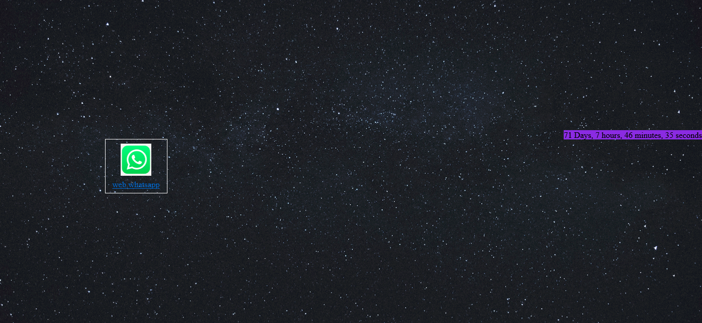
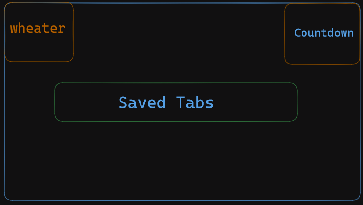

# introduction

Our mission is to make a tab that is for everyone.
This extention/Add-on is for firefox focused currently.

Our moto is "The only tab you need"

v0.0.1

# Vision

Right now it is in development phase. 
it is big project and i want to take things slow , so here is little sneak peak 

   1. You can add countdowns to specific days to make you more productive like you want to learn a language in 1 month so you set the countdown and everytime you open your browser you can see it there 

2.it has saved links , these links are not bookmarks , the bookmarks are there you use them or you never use them but the thing about saved links are this , is that saved links/tabs will be those tabs that you know you will be using daily for example you save the learning platform there and bunch of other things so it increases productivety rather then typing the url or finding the site in the bunch of bookmarks you can just click it in your saved tabs 

3.it has weather 

4.i maybe add pomodoro 

  5.  I may add small to do list that you can use to see your daily tasks 

   6. And maybe add notes also , so you can add temporary notes if you want 

And MANY MORE THIS WAS JUST A SNEAK PEAK, as i said i want to take things slowly. 

below are the images of devlopment phase and vision 

# Features

there are the features right now need to added

1.Countdown ✔ \
2.Tab Save Button  ✔ \
3.Tab Delete Button ✔\
4.Tab Icon Save ❌\
5.Countdown on the upper right corner ❌\
6.Weather on the upper left corner ❌

# Devlopment

It is very easy to develop in your local enviroment , it just takes about 3 steps

 1.To develop this project in local envirment just simply download or clone this project \

2.then go to this link "about:debugging#/runtime/this-firefox" on firefox \

3.and then finally click on "Load Temporary Add-on" and select manifest file 
